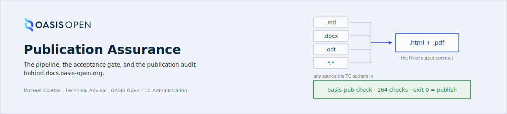
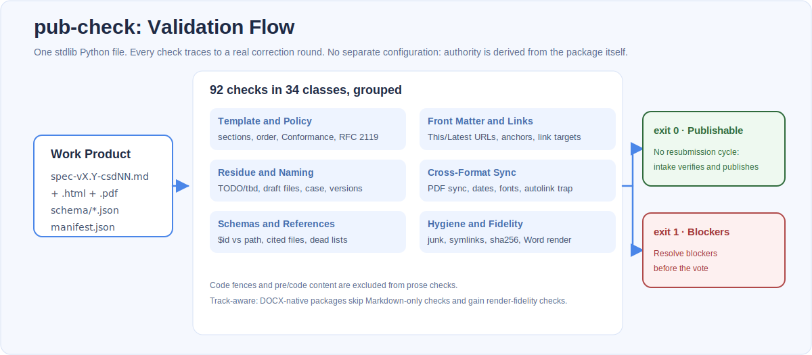
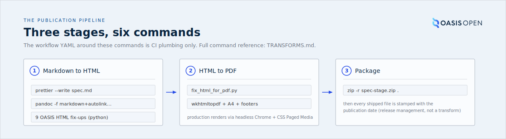
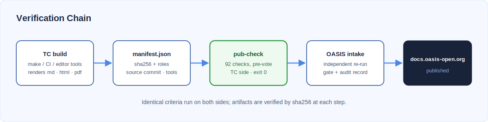
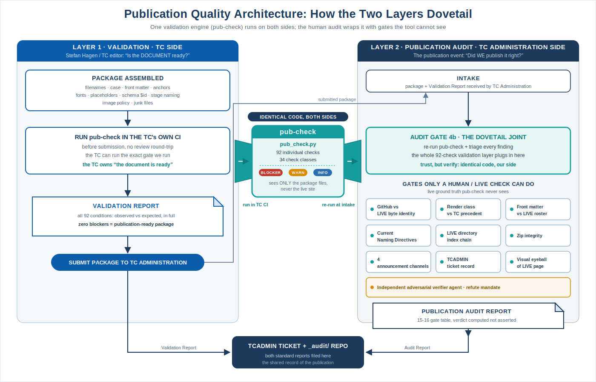
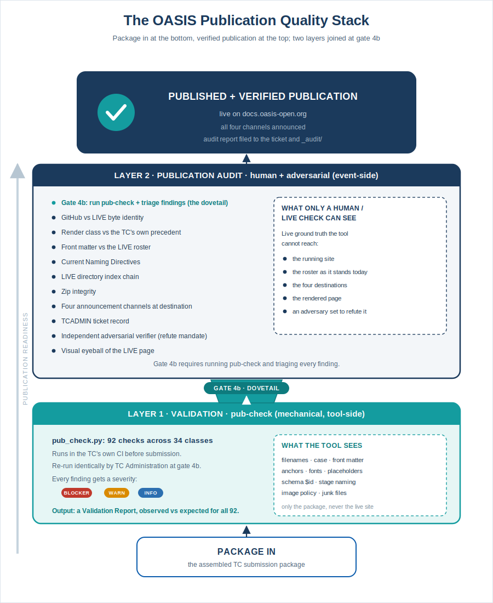

<!--
Copyright 2025-2026 OASIS Open
SPDX-License-Identifier: Apache-2.0
Authored by Michael Coletta, Technical Advisor to OASIS Open.
-->



<p align="center">
  <a href="LICENSE"></a>
  <a href="NOTICE"></a>
  
  
  
  
</p>

**Author: Michael Coletta, Technical Advisor, OASIS Open**

A generic sandbox for the machinery that publishes OASIS TC work products to
`docs.oasis-open.org`: the pipeline and the acceptance gate, for any TC on
either authoring track. CSAF is the worked example: the archived packages
under `csaf/` and `csaf-cvrf/` are the regression corpus, not the scope.

This repository contains:

1. **The open publication pipeline**: the Markdown-to-HTML-to-PDF machinery OASIS
   uses to turn a TC's authoritative markdown into the artifacts published at
   `docs.oasis-open.org`. [TRANSFORMS.md](TRANSFORMS.md) documents every
   transform, command by command.
2. **The publication gate**: [`pub-check/`](pub-check/), the TC-side version of
   the acceptance checks OASIS TC Administration applies to a submitted work
   product. Run it in your own build before the vote to catch publication
   issues before submission.

---

## pub-check: publication readiness checks



```bash
python3 pub-check/pub_check.py <stage-dir or submission.zip>   # exit 0 = publishable
python3 pub-check/pub_check.py <stage-dir> --emit-manifest     # + provenance manifest
python3 pub-check/pub_check.py <stage-dir> --json              # machine-readable
```

pub-check is one Python file, uses only the standard library, and needs no
configuration. Every expectation
is derived from the package itself (its own front matter, its own CSS, its own
schema `$id`s). The 92 individual checks (34 check classes; `--list-checks` asserts the inventory from the code) cover template structure and the TC
Process Conformance requirement, stage naming and version-directory conventions, live revision-collision probing, filename conventions,
front-matter URL consistency, editor residue, internal anchors, the pandoc
autolink trap, schema `$id` vs publish path, PDF-vs-source sync, PDF embedded
fonts vs the package's own stylesheet, case sensitivity, junk files, dead
`lists.oasis-open.org` addresses, RFC 2119/8174 citation, cited-but-not-shipped
files, visible-URL/link-target mismatches, and double-slash paths the CDN
rejects. Full table with severities: [pub-check/README.md](pub-check/README.md).

Every check traces to a real publication correction round. The gate is
calibrated against a 13-package regression corpus:

| Package | Result |
|---|---|
| EoX-Core v1.0 csd01 **RC1** (known-bad submission) | **13 blockers**, reproducing the manual TC Admin review |
| EoX-Core v1.0 csd01 **RC3** (as published) | publishable |
| CSAF v2.0 csd02, cs01 to cs03, os, errata01 (csd01 + os) | publishable |
| CSAF v2.1 csd01 | publishable |
| CSAF v2.0 csd01 | 2 blockers: one `TODO: add the link.` that really shipped in 2021, caught in both the markdown and the HTML |
| KMIP Spec + Profiles v3.0 csd02 (DOCX-native) | publishable; warnings are real dangling bookmarks inherited from the source DOCX |

## Pipeline stages



Three GitHub Actions wrap six commands. Nothing else in the YAML affects the
output. [TRANSFORMS.md](TRANSFORMS.md) documents the exact commands, the nine
OASIS-specific HTML fix-ups, and the renderer's limits. Run them from the
Actions tab (each takes a stage directory and a date) or locally.

## Verification chain



If the package ships a `manifest.json` conforming to
[pub-check/manifest-schema.json](pub-check/manifest-schema.json) (per file:
sha256 and role; plus source commit and tool versions), OASIS intake can
verify it directly. The TC's build records what it produced, the gate checks it
against the criteria, and the manifest lets every later step verify both.

## Where the gate sits: validation and audit



Two layers, one engine. The TC side runs pub-check in its own CI and owns
"the document is ready": all 92 conditions, each reported as the value the
tool pulled from the package set against the value it was compared to, in
full. TC Administration re-runs the identical code at intake (audit gate 4b)
and wraps it with the gates only a human or a live check can do: byte
identity against the published site, render class against the TC's own
precedent, the live roster, directory index chains, announcement channels,
and an independent adversarial verifier. Both reports are filed to the TC's
ticket and the internal audit record.



Sources and a regenerating build script:
[assets/architecture/](assets/architecture/).

## CI

[`.github/workflows/pub-check.yml`](.github/workflows/pub-check.yml) defines
the CI path: checkout, Python, `poppler-utils` for the optional PDF checks,
one command. A one-line make target does the same:

```make
pub-check:
	python3 pub-check/pub_check.py path/to/stage-dir
```

## Repository structure

<details>
<summary>Full layout</summary>

```
publication-sandbox/
├── pub-check/                       # The publication gate
│   ├── pub_check.py                 #   92 individual checks in 34 classes, stdlib only
│   ├── manifest-schema.json         #   provenance manifest contract
│   └── README.md                    #   checks, severities, corpus (canonical criteria)
├── TRANSFORMS.md                    # The pipeline, command by command (canonical criteria)
├── assets/                          # README diagrams (SVG)
├── .github/
│   ├── src/                         # Pipeline source (pandoc + BeautifulSoup post-processing,
│   │                                #   HTML preprocessor, wkhtmltopdf renderer)
│   ├── scripts/                     # Shell entry points used by the workflows
│   ├── styles/                      # OASIS markdown-styles CSS lineage (v1.1 → v1.8.1)
│   └── workflows/                   # step_1 (MD→HTML), step_2 (HTML→PDF),
│                                    #   step_3 (zip), pub-check (the gate)
├── csaf/                            # Archived CSAF work products (v2.0 lineage, v2.1 csd01)
├── csaf-cvrf/                       # Archived CSAF-CVRF v1.2 work products
├── LICENSE                          # Apache-2.0 (software tier)
└── NOTICE                           # The three-tier IP statement
```

</details>

## Key technologies

Python 3.10+ · Pandoc · BeautifulSoup4 · Prettier · wkhtmltopdf (this sandbox)
/ headless Chrome + CSS Paged Media (current production) · GitHub Actions ·
poppler (`pdftotext`/`pdffonts`, optional, for the PDF cross-checks)

## License

Three tiers, stated precisely in [NOTICE](NOTICE):

1. **Software** (the document-processing pipeline under `.github/` and the
   pub-check gate under `pub-check/`) is licensed under the
   [Apache License, Version 2.0](LICENSE).
   Copyright OASIS Open. Authored by Michael Coletta, Technical Advisor to
   OASIS Open. Every source file carries an SPDX header.
2. **Acceptance-criteria documentation** (`TRANSFORMS.md` and
   `pub-check/README.md`) is Copyright OASIS Open, All Rights Reserved:
   verbatim distribution is permitted with notices retained; derivative
   works require prior written authorization from OASIS Open. These
   documents are the canonical statement of the OASIS publication
   acceptance criteria.
3. **Archived OASIS specification packages** (`csaf/`, `csaf-cvrf/`) are
   OASIS Work Products and retain their own published OASIS copyright, IPR,
   and license notices. Nothing in this repository relicenses them.

The OASIS name and logo are trademarks of OASIS Open.

---

**Repository maintained by**: Michael Coletta, Technical Advisor, OASIS Open  
**Contact**: michael.coletta@oasis-open.org (OASIS TC Administration)  
**Documentation**: [TRANSFORMS.md](TRANSFORMS.md) for the pipeline, [pub-check/](pub-check/) for the publication gate, individual specification folders for spec-level detail
